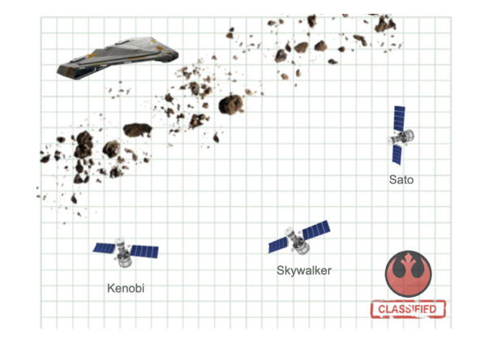

# meli_quasar
Proyecto para entrevista Mercado Libre

 .

API queda conecta al DNS ec2-54-208-177-206.compute-1.amazonaws.com en puerto 80

Ej. http://ec2-54-208-177-206.compute-1.amazonaws.com:80/topsecret_split/sato

POST body:
{
    "distance": 100.0,
    "message": ["este", "", "", "mensaje", ""]
}

Se recomienda utilizar Postman para probar o navegador para enviar request

## Instalar dependencias
1. Tener node instalado en el systema
2. Tener npm (Node Package Manager) 
3. Para instalar se debe usar el comando `npm install` dentro de la carpeta del repo

## Testing
Se utiliza Jest para probar y corroborar el correcto funcionamiento del proyecto 
### Instalar usando 
`npm install --save-dev jest`

## Deploy
### Deploy Docker
El sistema se levanta con Docker container, Dockerfile se encuentra en el repo. 
Se debe tener instalado Docker Engine -> https://docs.docker.com/engine/install/ubuntu/  
Para construirlo se tiene el bash script build.sh , el cual debe ejecutarse con `sh build.sh`  
Para hacer el deploy usar el bash script start_quasar.sh de forma analoga al build  

### Deploy Directo 

Para ejecutar directamente se deben haber instalado las dependencias con `nmp ci --only=production` o con `npm install` dentro de la ruta del repo  
Una vez actualizadas las dependecias se puede inciar el servicio con `node server.js`  

## Configs
El servidor usa el puerto 5000 por defecto o la variable de entorno PORT a definir dentro del contenedor  
Para habilitar otro puerto publicamente exponer en otro puerto en el scrip start_quasar.sh , por simplicidad se habilita en el puerto 80 de la instancia AWS
